# Weaving-Shell-Structures

##### Description

This project uses a non-linear, iterative strategies of subdivision (weaving by particles) for the design of a coherent formation/demonstrator/pavilion, focusing on its constructability as clarity and
coherence of geometry, detail and process. The computational approach is divided into a primary woven structure with their respective intersection points and the secondary structure following the same logic. The primary structure begins with the generation of a surface from which the particles are created and moved by using spin forces. The resulting nodes between the lines are evaluated to control the weaving distance. A list of elements are then created, to function as connections between the primary curves. The secondary structure emerges from equidistant points on the resulting primary curves. The following images explains visually the specific strategy.

**Weaving through spin forces 2D principals:**
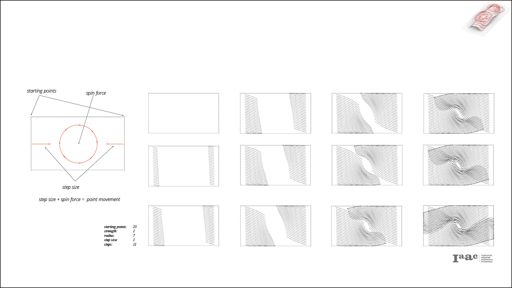

**Generating spin forces patterns on surface:**
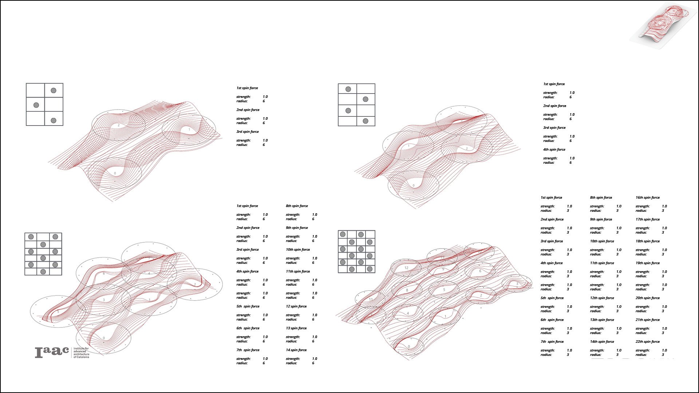

**Weaving through spin forces 3D principals**
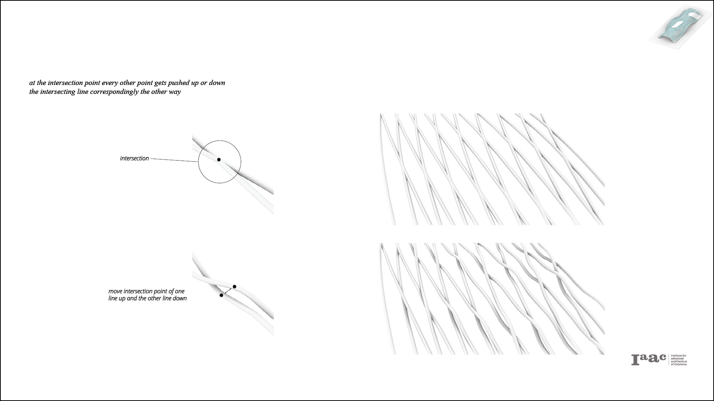

**From intersection to connection**
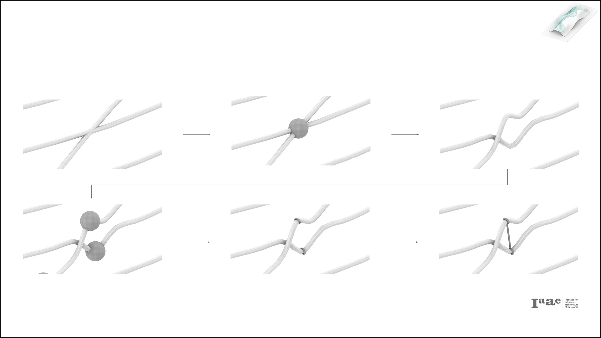

**Distance variations**
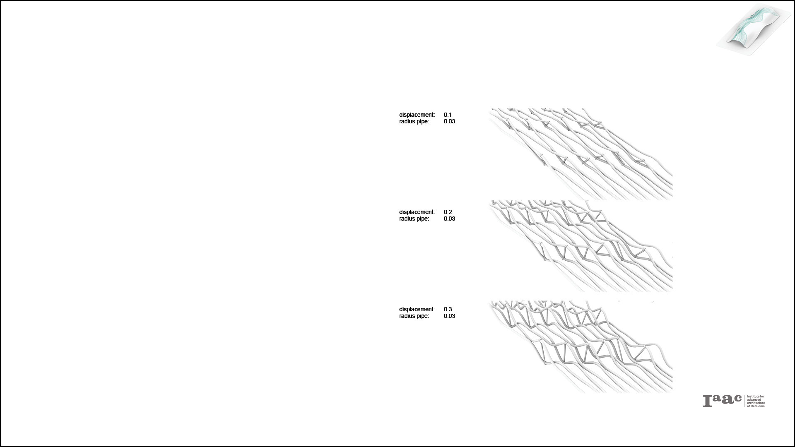

**Secondary structure**
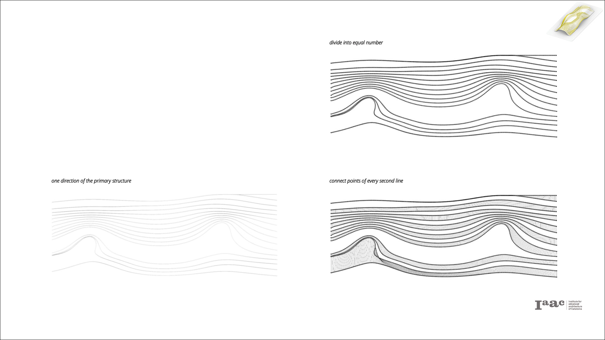

**Secondary structure detail**
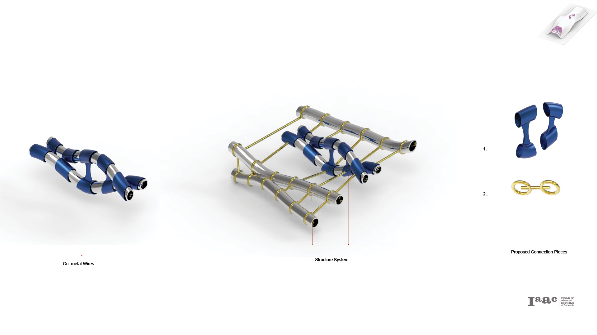

**Studies - Application on the system**
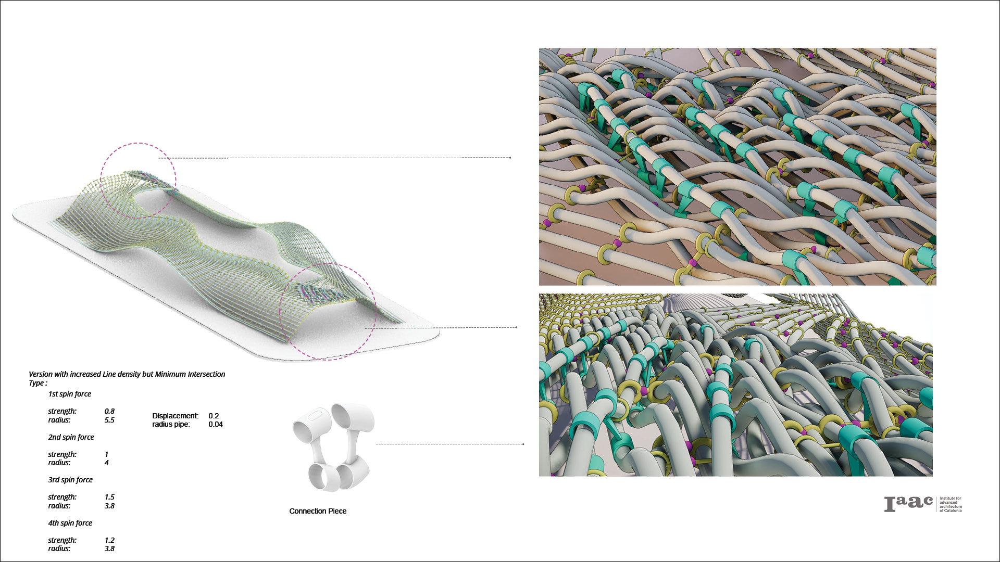

**Overall system -
Desired Density**
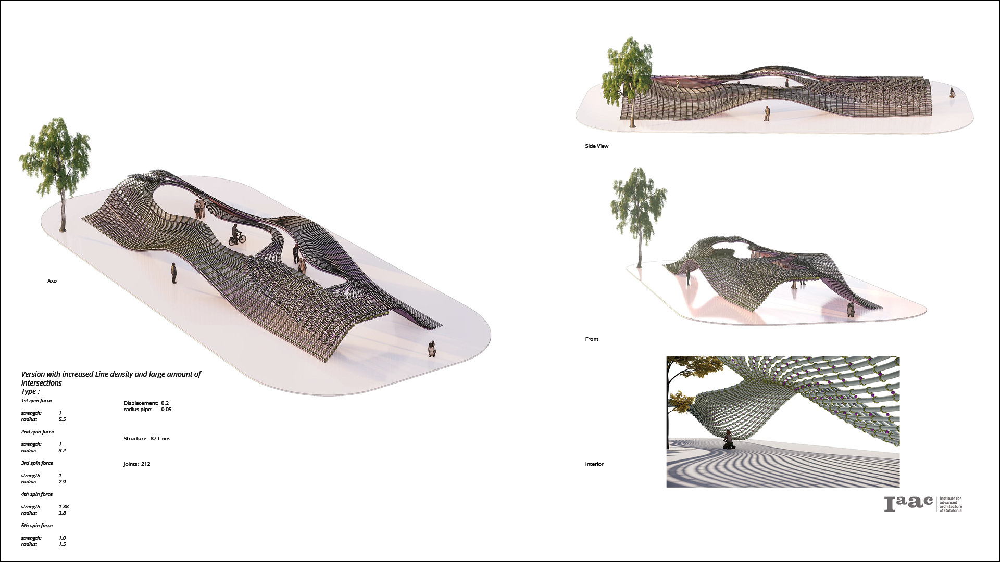

##### Requirements

* Rhinoceros 5 or 6.
* Grasshopper 3d plugin for Rhinoceros.
* Anemona plugin for grasshopper.
* Kangaroo 2 plugin for grasshopper.

This code has been tested on Rhinoceros on windows

##### Workflow
**Strategy:**
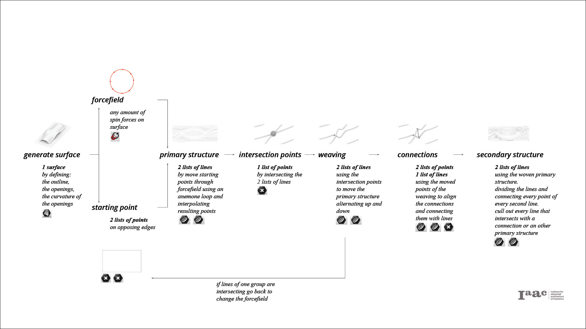

**Process steps:**
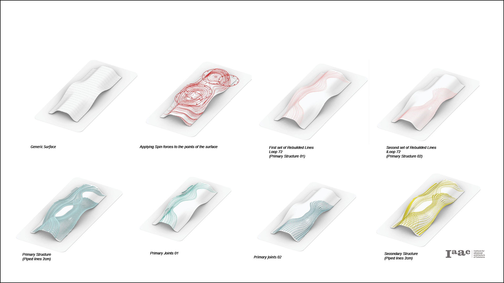

##### References

* [Jean Draper](https://www.amazon.co.uk/Stitch-Structure-Technique-three-dimensional-textiles/dp/1849941211)
Jean Draper is an experienced textile artist whose work explores the impact of time, weather and man on the environment. She is an exhibiting member of the prestigious 62 Group of Textile Artists and the Textile Study Group and her work is in public and private collections throughout the UK and abroad.

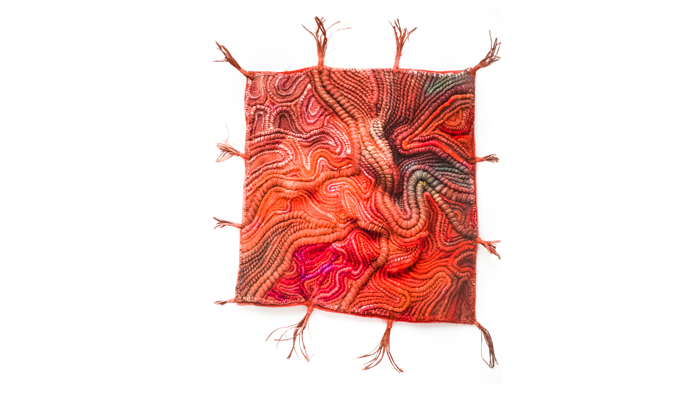

* [Iris Van Herpen](https://www.irisvanherpen.com/news/hypnosis-though-the-lens-of-albert-watson)
Iris van Herpen is a Dutch fashion designer. Van Herpen started her fashion label in 2007. She is a guest member of the Parisian Chambre Syndicale de la Haute Couture, part of the Fédération française de la couture.

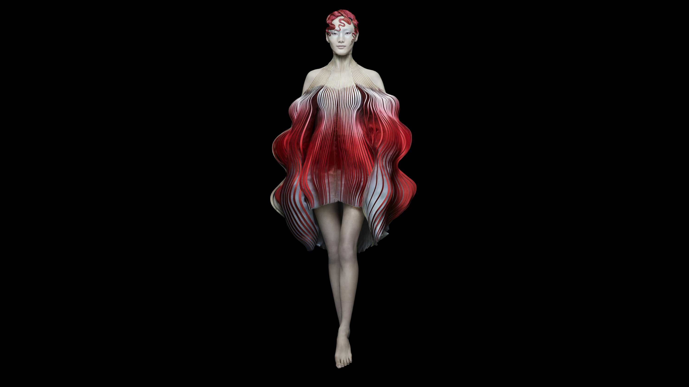

##### Credits
_Based on IAAC publishing guidelines:
(Weaving-Shell-Structures) is a project of IaaC, Institute for Advanced Architecture of Catalonia. developed at Master in Robotics and Advanced Construction in 2019-2020 by:
Students: (Alexandros Michail Varvantakis, Cedric Droogmans and Roberto Vargas Calvo)
Faculty: (Alessio Erioli)
Faculty Assistant: Eugenio Bettucchi_
